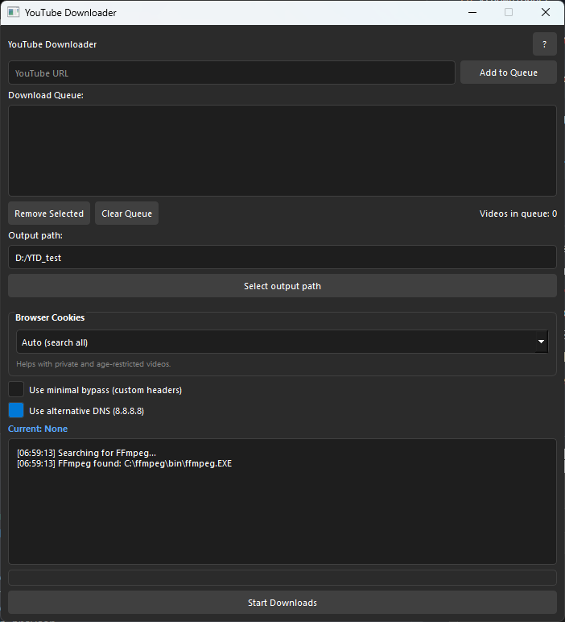
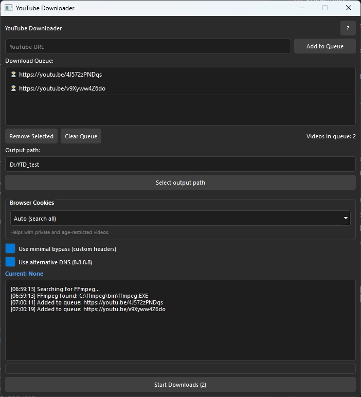
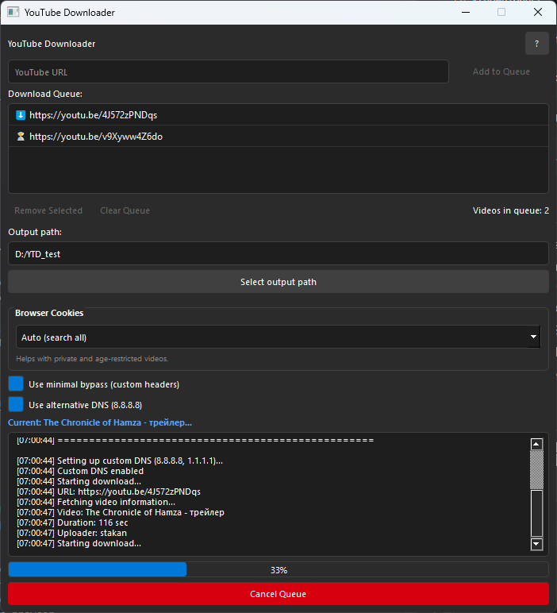
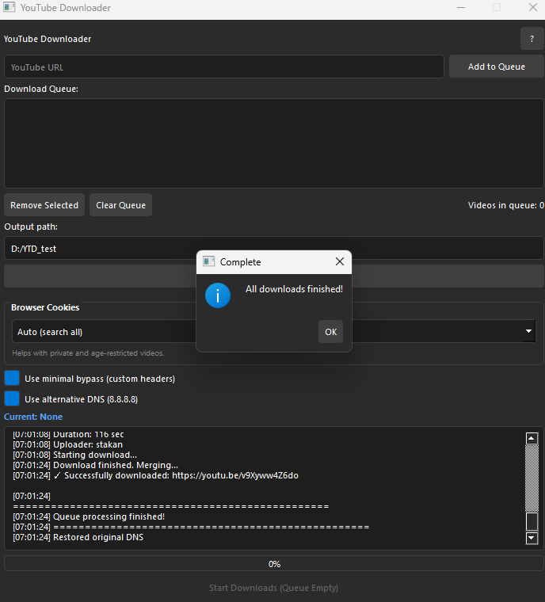

# YT Downloader

Desktop application for downloading YT videos with queue support and ISP blocking bypass features.

## Features

- **Cross-Platform**: Works on Windows and Linux
- **Queue Management**: Add multiple videos and download them sequentially
- **Browser Cookies**: Automatically extract cookies from browsers for private/age-restricted videos
- **Network Block Bypass**: 
  - Custom DNS resolver (Google DNS 8.8.8.8, Cloudflare 1.1.1.1)
  - Custom HTTP headers
- **High Quality**: Downloads best quality up to 1080p with audio merge
- **Dark Theme UI**: Modern, easy-on-the-eyes interface


## Requirements

### Python Dependencies
```bash
pip install PyQt5 yt-dlp browser-cookie3 dnspython
```

### External Tools
- **FFmpeg** (required for video merging)
  - **Windows:** Download from [ffmpeg.org](https://ffmpeg.org/download.html)
  - Add to system PATH or select manually in the app
  - **Linux:** `sudo apt install ffmpeg` in terminal

## Installation

### Option 1: Download Pre-built Executable (Windows)

Download the latest release from the [Releases](https://github.com/stakanyash/ytdownloader/releases) page.

> [!WARNING]
> The executable compiled with Nuitka may trigger false positives in some antivirus software. This is a common issue with Python applications compiled to .exe files. The application does not contain any malicious code - it only downloads videos using yt-dlp and accesses browser cookies for authentication. If your antivirus flags the file, you may need to add it to your exceptions list. I'm apologize for any inconvenience.

### Option 2: Run from Source

1. Clone the repository:
```bash
git clone https://github.com/stakanyash/ytdownloader.git
cd ytdownloader
```

2. Install dependencies:
```bash
pip install -r requirements.txt
```

3. Run the application:
```bash
python ./src/main.py
```

## Usage

1. **Add Videos**: Paste YouTube URL and click "Add to Queue"
2. **Configure Settings**:
   - Select output directory
   - Choose browser for cookie extraction (helps with restricted videos)
   - Enable DNS bypass if needed
3. **Start Download**: Click "Start Downloads" to process the queue
4. **Wait until download is finished**

## Screenshots






## Supported Browsers

- Chrome
- Firefox
- Edge
- Opera
- Brave
- Chromium
- Vivaldi

## Built With

- [Python](https://www.python.org/)
- [PyQt5](https://riverbankcomputing.com/software/pyqt/) - GUI framework
- [yt-dlp](https://github.com/yt-dlp/yt-dlp) - Video downloader
- [browser-cookie3](https://github.com/borisbabic/browser_cookie3) - Cookie extraction
- [dnspython](https://github.com/rthalley/dnspython) - DNS resolver

## License

This project is open source and available under the MIT License.

## Author

**stakan**
- GitHub: [@stakanyash](https://github.com/stakanyash)

## Disclaimer

This tool is for educational purposes only. Make sure you have the right to download any content and respect copyright laws.
